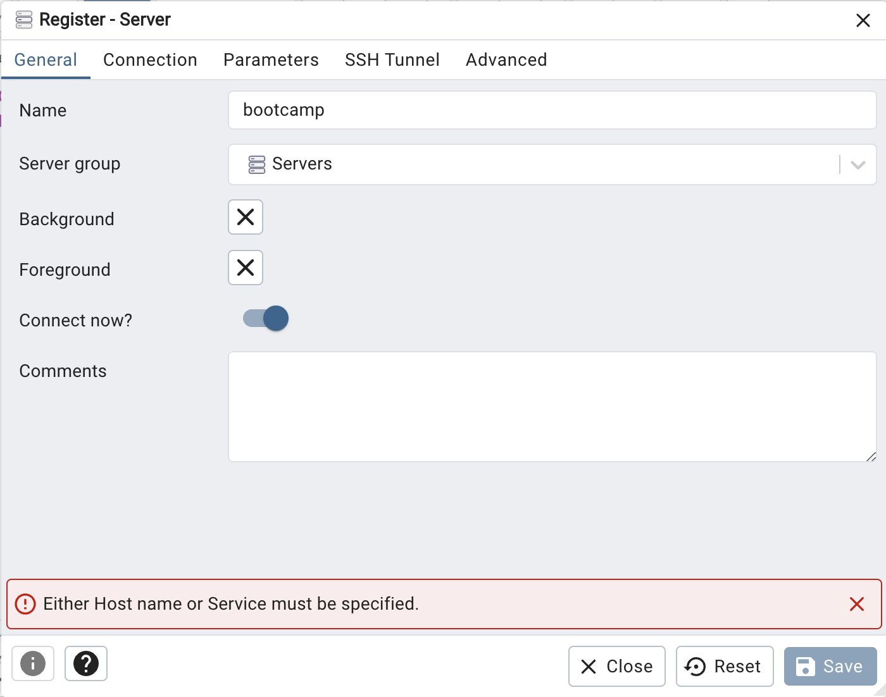
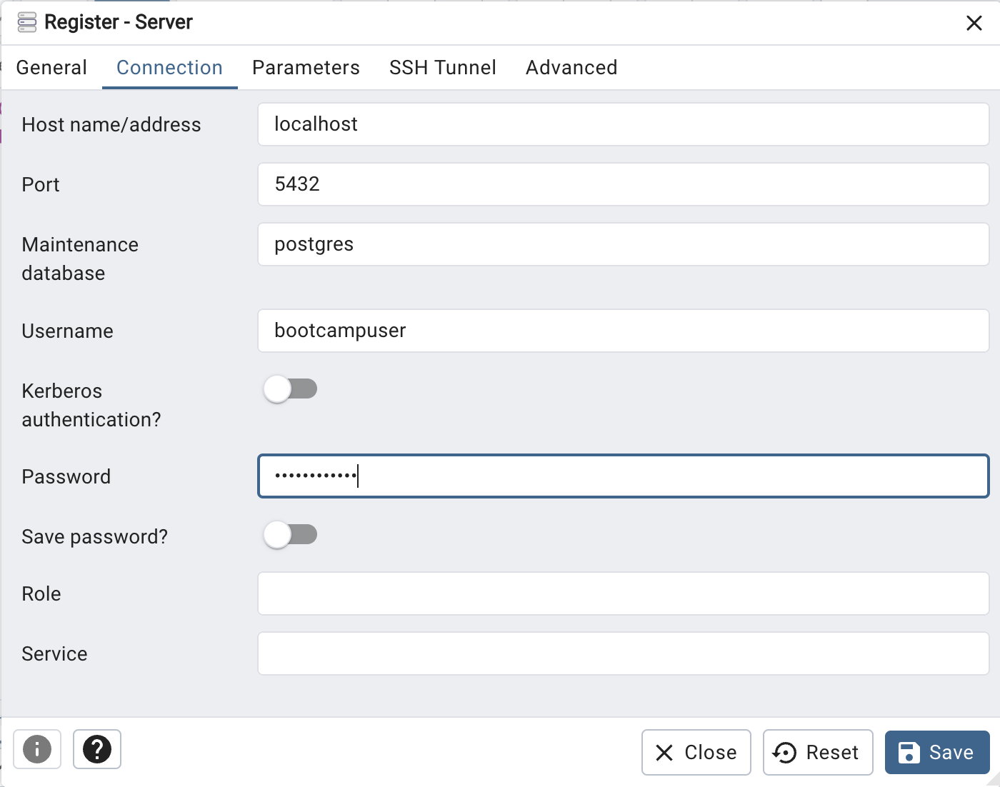
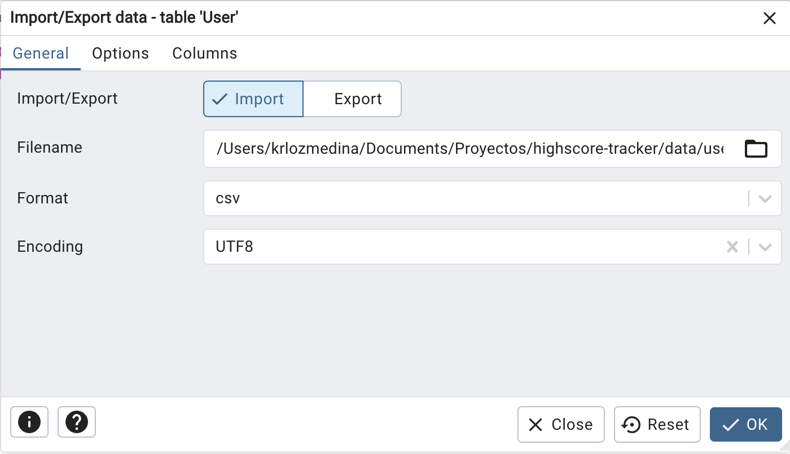

# Pasos para configurar el proyecto con las bases de datos en Docker:

1. **Abrir la Terminal en la Raíz del Proyecto**

2. **Configurar la Base de Datos de MongoDB**

    Ejecuta los siguientes comandos para inicializar y configurar MongoDB:

    ```bash
    docker compose up -d
    ```

    Accede al contenedor de MongoDB:

    ```bash
    docker exec -it mongodb mongosh
    ```

    Luego, en el entorno mongosh, ingresa los siguientes comandos para crear una base de datos y un usuario:

    ```bash 
    use admin
    ```

    ```bash
    db.auth('root', 'root')
    ```

    ```bash
    db = db.getSiblingDB('bootcamp')
    ```

    ```bash
    db.createUser({
        user: 'bootcampuser',
        pwd: 'bootcamppass',
        roles: [{
            role: 'dbOwner',
            db: 'bootcamp'
        }]})
    ```

    ```bash
    exit
    ```

3. **Importar Datos a MongoDB**

    Ejecuta el siguiente comando para importar los datos desde `data/scores.json`:

    ```bash
    docker exec -i mongodb sh -c "mongoimport -c scores -d bootcamp -u bootcampuser -p bootcamppass --jsonArray --drop" < data/scores.json
    ```

4. **Configurar la Base de Datos de PostgreSQL**

    Navega a la carpeta del backend:

    ```bash
    cd packages/backend/
    ```

    Ejecuta la migración inicial con Prisma para crear las tablas en PostgreSQL:

    ```bash
    pnpx prisma migrate dev —name init
    ```

    Regresa a la raíz del proyecto:

    ```bash
    cd ../../
    ```

5. **Ejecutar el Proyecto**

    Inicia el proyecto con el siguiente comando:

    ```bash
    pnpm dev
    ```

6. **Importar Datos a la Base de Datos de PostgreSQL**

    1. Abre el aplicativo pgAdmin 4.
    2. Registra el servidor PostgreSQL.
        - En la pestaña `General`, ingresa un nombre, por ejemplo: `bootcamp`

        

    3. En la pestaña Connection, ingresa los siguientes datos:

        - Hostname: `localhost`
        - Username: `bootcampuser`
        - Password: `bootcamppass`

        

7. **Importar Archivo CSV en PostgreSQL**

    1. Busca la tabla `user` en pgAdmin 4.

    2. Haz clic derecho en la tabla `user` y selecciona `Import/Export Data....`

    3. Selecciona el archivo `users.csv` que está en la carpeta `data`.

    4. Configura el formato como `csv` y el encoding como `UTF8`.

    

Con estos pasos, deberías poder configurar las bases de datos de MongoDB y PostgreSQL en Docker y cargar los datos iniciales necesarios para el proyecto.